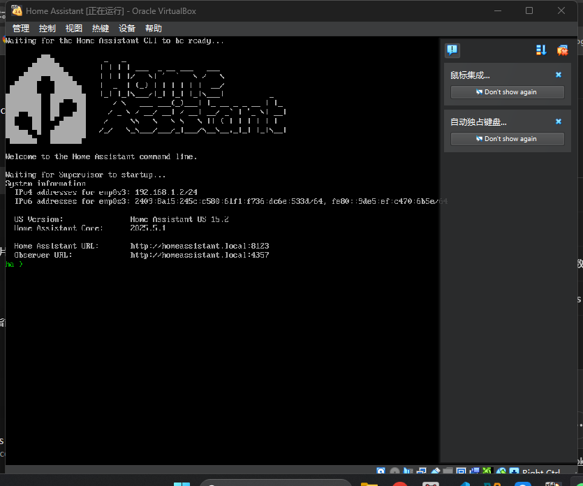
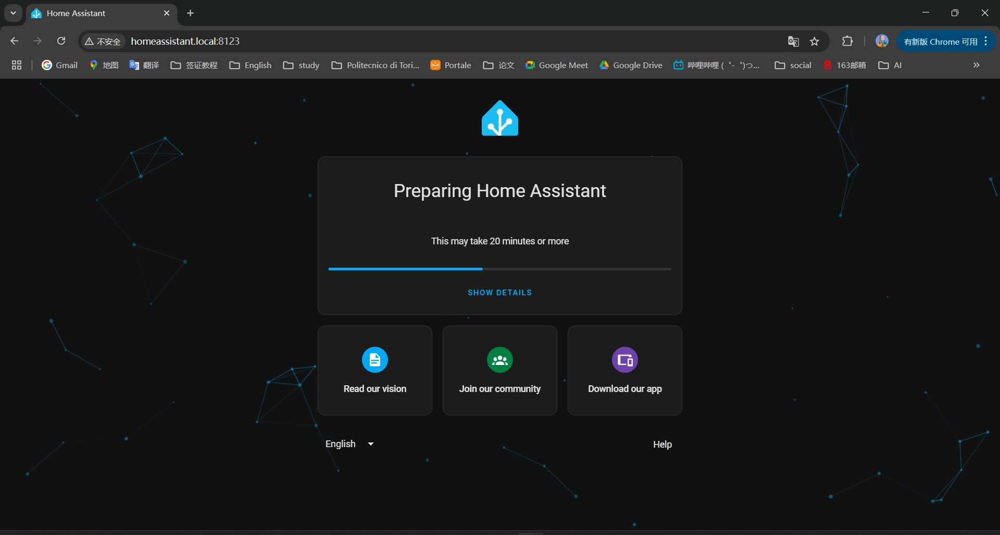
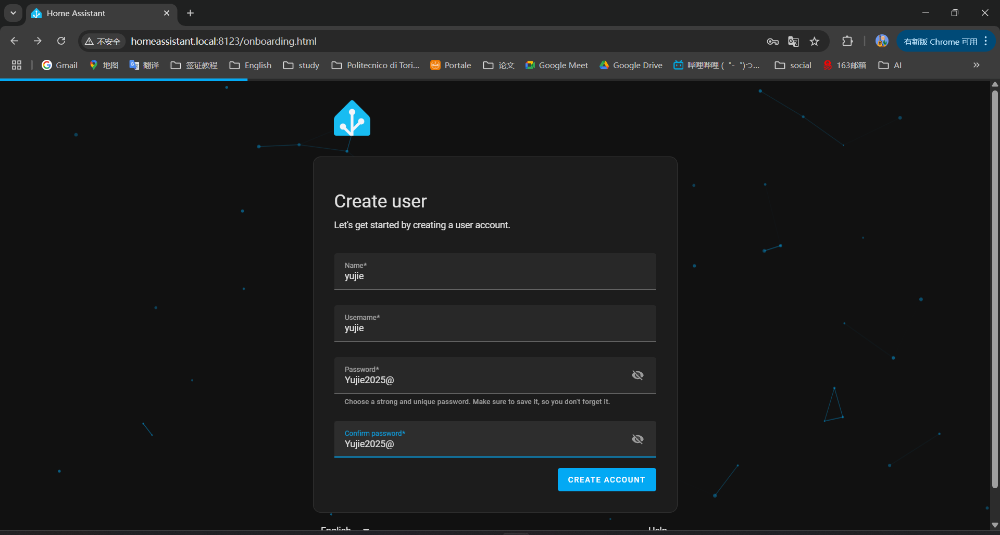
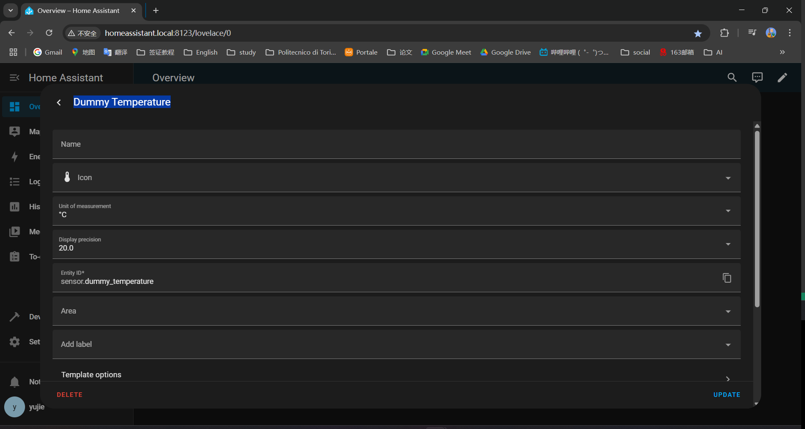
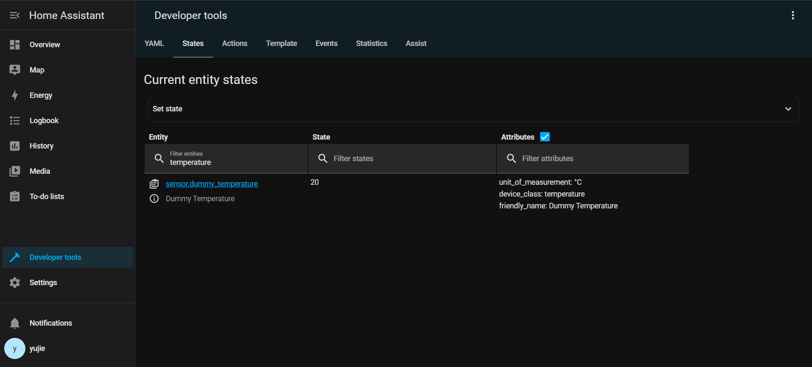
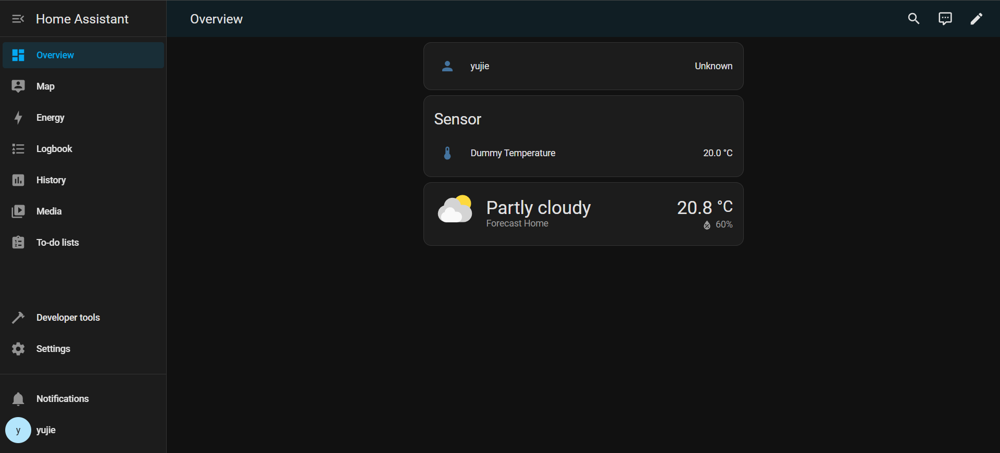

<!-- docs/Home_Assistant_installation.md -->
# Home Assistant – Hands-on Report  
*Author: Yujie · Dora Requirements Sprint – May 2025*

The report documents the local setup of Home Assistant OS, the registration of a dummy sensor and an Android-TV integration, and includes installation notes and screenshots to surface any edge-case issues.

---

## 1  Environment

*Home Assistant OS is installed and running inside a VirtualBox VM on a Windows 11 host machine*

| Item | Value |
|------|-------|
| Host OS | Windows 11 × VirtualBox 7.1.8 |
| HA Image | Home Assistant OS 15.2 (.vdi) |
| VM Resources | 2 vCPU · 4 GB RAM · 32 GB disk |
| Network mode | **Bridged** → Killer E2600 (Ethernet) |

## 2 Steps of setup

### 1.Download ‘haos_ova-15.2.vdi’ from the Windows installation page.

### 2.Create a new virtual machine in VirtualBox
### 3.Start the, VM Click Start, and then SHOWS "ha >", indicating that the system has started up
  
*Home Assistant CLI after first boot*

### 4.Accessing Home Assistant. Open http://homeassistant.local:8123 in the host browser to complete onboarding.

*Preparing HA for first boot*

### 5.create an administrator account and set the location/language to enter the main interface.

Create Account

## 2  Dummy Temperature Sensor

### 2.1  Configuration

### 2.2  Sensor state

### 2.3  Overview dashboard

## 3 Android TV

### 3.1 TV preparing
*I have a Android TV, but it's version is Android 4.0.4. I tried to connect using a wired network cable, but it may be because the version is too low and the detection of the IP address failed. So that it can not be found by Home Assistant.

## 4 Edge Case — Legacy IPTV Set-Top Box (Android 4.0.4)

**Context**  
Some households still rely on ISP-supplied IPTV boxes that run a heavily-modified Android 4.0.4 build (pre-Android TV).  
The firmware exposes no *Developer options*, therefore neither *USB debugging* nor *ADB over network* can be enabled.

**Observed behaviour**  
- Home Assistant cannot discover the box via mDNS or connect on TCP 5555.  
- Manually adding the **Android TV / ADB** integration in HA returns *“Cannot connect”*.  
- Dora’s Smart-TV and Tele-assistance modules have no control channel to the TV.

**Risk**  
Lack of TV connectivity undermines key requirements for cognitive games, remote assistance, and social engagement.

**Requirements**  
The platform must detect devices running Android \< 5.0 and present an *“Unsupported Android version”* banner.  

**Open questions**  
- Should the operator portal raise an *incompatible-device* alert for caregivers?  
- Worth integrating a low-cost IR blaster add-on in the reference hardware kit?
