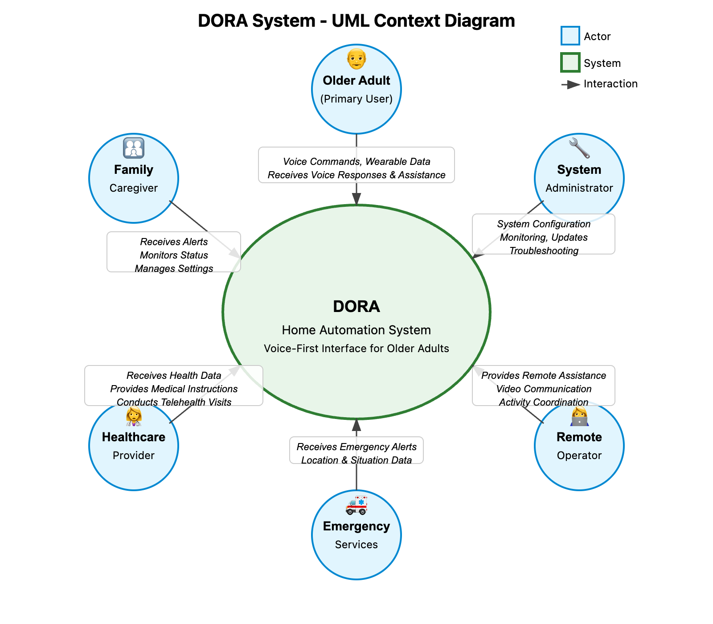
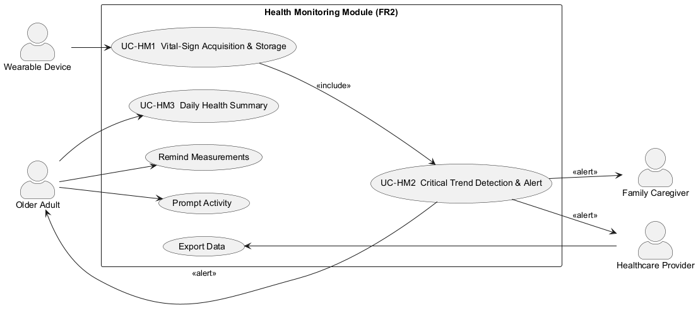
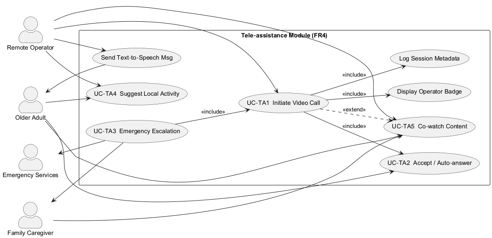
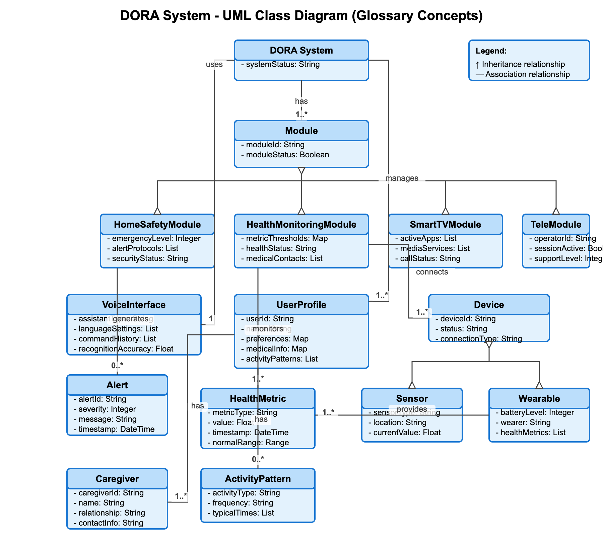
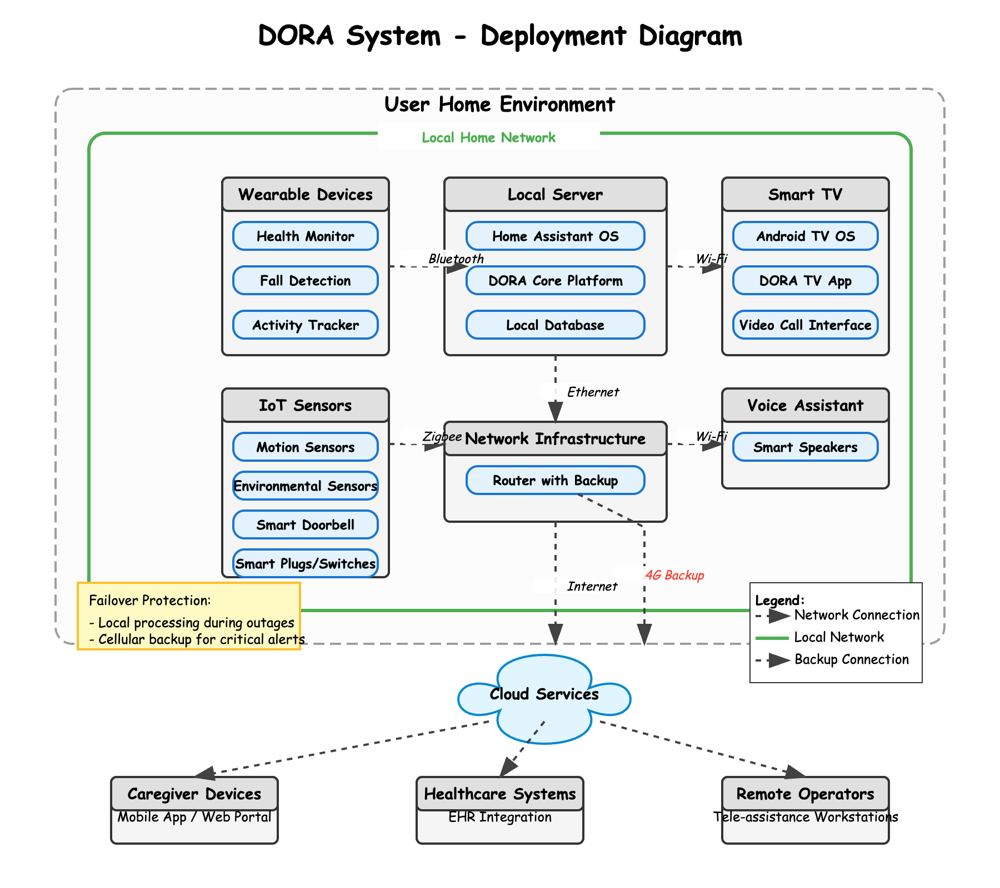

# Requirements Document - Dora

Date:

Version: 

| Version number | Change |
| :------------: | :----: |
|                |        |

# Contents

- [Requirements Document - Dora](#requirements-document---dora)
- [Contents](#contents)
- [Informal description](#informal-description)
- [Business Model](#business-model)
- [Stakeholders](#stakeholders)
- [Context Diagram and interfaces](#context-diagram-and-interfaces)
  - [Context Diagram](#context-diagram)
  - [Interfaces](#interfaces)
- [Stories and personas](#stories-and-personas)
  - [Persona 1: Maria (Older Adult)](#persona-1-maria-older-adult)
  - [Persona 2: Paolo (Family Caregiver)](#persona-2-paolo-family-caregiver)
  - [Persona 3: Dr. Bianchi (Healthcare Provider)](#persona-3-dr-bianchi-healthcare-provider)
  - [Persona 4: Elena (Remote Operator)](#persona-4-elena-remote-operator)
- [Functional and non functional requirements](#functional-and-non-functional-requirements)
  - [Functional Requirements](#functional-requirements)
  - [Non Functional Requirements](#non-functional-requirements)
- [Acceptance Criteria](#acceptance-criteria)
  - [Acceptance Criteria – Module 2 Health Monitoring](#ac-module-2)
  - [Acceptance Criteria – Module 4 Tele-assistance](#ac-module-4)

- [Access Rights](#access-rights)
- [Use case diagram and use cases](#use-case-diagram-and-use-cases)
  - [Use case diagram](#use-case-diagram)
  - [Use Cases: Module2-Health Monitoring](#use-cases-module2-health-monitoring) 
    - [Use case 1, UC-HM1: Vital-Sign Acquisition & Storage](#use-case-1-uc-hm1-vital-sign-acquisition--storage)
      - [Scenario 1.1 – Link-loss buffering](#scenario-11--link-loss-buffering)
    - [Use case 2, UC-HM2: Critical Trend Detection & Alert](#use-case-2-uc-hm2-critical-trend-detection--alert)
      - [Scenario 2.1 – False positive cleared](#scenario-21--false-positive-cleared)
    - [Use case 3, UC-HM3: Daily Health Summary on Demand](#use-case-3-uc-hm3-daily-health-summary-on-demand)
      - [Scenario 1.1 – Successful summary playback](#scenario-11--successful-summary-playback)
  - [Use Cases: Module4-Tele-assistance](#use-cases-module4-tele-assistance)
    - [Use case 1, UC-TA1: Operator-Initiated Video Call](#use-case-1-uc-ta1-operator-initiated-video-call)
      - [Scenario 1.1 – No answer ⇒ caregiver escalation](#scenario-11--no-answer--caregiver-escalation)
    - [Use case 2, UC-TA2: Emergency Escalation Workflow](#use-case-2-uc-ta2-emergency-escalation-workflow)
      - [Scenario 2.1 – Operator resolves before EMS](#scenario-21--operator-resolves-before-ems)
    - [Use case 3, UC-TA3: Suggest Local Activity](#use-case-3-uc-ta3-suggest-local-activity)
      - [Scenario 3.1 – “Maybe” deferral](#scenario-31--maybe-deferral)
- [Glossary](#glossary)
  - [Key Terms and Concepts](#key-terms-and-concepts)
- [System Design](#system-design)
  - [Architectural Layers](#architectural-layers)
    - [1. Device Layer](#1-device-layer)
    - [2. Integration Layer](#2-integration-layer)
    - [3. Service Layer](#3-service-layer)
    - [4. Intelligence Layer](#4-intelligence-layer)
    - [5. Interface Layer](#5-interface-layer)
    - [6. Security and Privacy Layer](#6-security-and-privacy-layer)
  - [Data Flow](#data-flow)
  - [Fault Tolerance and Reliability](#fault-tolerance-and-reliability)
- [Deployment Diagram](#deployment-diagram)
  - [Physical Component Deployment](#physical-component-deployment)
    - [User Home Environment](#user-home-environment)
    - [External Components](#external-components)
  - [Communication Pathways](#communication-pathways)

# Informal description

DORA is a home automation system designed to support older adults in their homes through voice interaction and smart technology. The system aims to improve quality of life from physical, psychological, and cognitive perspectives, allowing elderly individuals to maintain their independence without relocating for assistance. 

The platform integrates a commercial voice assistant, Android TV, IoT sensors, indoor cameras, smart plugs, wearables, and a local server into a cohesive ecosystem. DORA's modular design includes four key service blocks:

1. **Home Safety**: Uses sensors and automated responses to prevent accidents and detect emergencies
2. **Health Monitoring**: Tracks vital signs through wearables to monitor wellbeing
3. **Smart-TV Interaction**: Provides cognitive exercises and social engagement through a familiar interface
4. **Tele-assistance**: Connects users with remote operators for personalized support

DORA primarily uses voice commands for interaction, making it accessible to older adults with limited technology experience.

# Business Model

DORA addresses the growing market need for aging-in-place solutions with a modular service approach:

- **Target Market**: Primarily older adults (65+) and their caregivers, with particular focus on the 60% of seniors with chronic conditions and the 44% who live alone.

- **Value Proposition**: 
  1. For older adults: Increased independence, safety, and quality of life
  2. For caregivers: Reduced worry and physical/financial burden
  3. For healthcare systems: Decreased hospitalization rates and institutional care costs

- **Revenue Model**: 
  1. Base package including essential Home Safety features
  2. Optional add-on modules (Health Monitoring, Smart-TV Interaction, Tele-assistance)
  3. Subscription service for ongoing monitoring and updates
  4. Professional installation and setup services

- **Cost Structure**:
  1. Hardware (sensors, wearables, smart home devices)
  2. Software development and maintenance
  3. Cloud infrastructure for data processing
  4. Customer support and remote operator services

- **Strategic Partnerships**:
  1. Healthcare providers for medical monitoring integration
  2. Insurance companies for potential subsidization
  3. Voice assistant platform providers (e.g., Google, Amazon)
  4. Local senior service organizations for distribution

# Stakeholders

| Stakeholder name | Description |
| :--------------: | :---------: |
| Older Adults | Primary users of the system who benefit from increased safety, health monitoring, cognitive stimulation, and social connection while maintaining independence at home |
| Family Caregivers | Individuals responsible for monitoring and supporting older adults, benefiting from reduced physical and emotional burden |
| Healthcare Providers | Doctors and medical professionals who receive health data and can respond to emergencies or health concerns |
| Remote Operators | Staff who provide tele-assistance services through the system |
| System Administrators | Technical personnel responsible for maintaining and troubleshooting the system |
| Technology Providers | Companies supplying hardware components (sensors, wearables, etc.) and software integrations |
| Emergency Services | First responders who may be contacted automatically during emergencies |
| Insurance Companies | Organizations potentially subsidizing the system to reduce hospitalization costs |
| Regulatory Bodies | Entities defining standards for healthcare technology, data privacy, and home safety |
| Research Institutions | Organizations studying the effectiveness of the system and contributing to improvements |

# Context Diagram and interfaces

## Context Diagram

The context diagram illustrates the interaction between the DORA system and external actors including the Older Adult (primary user), Family Caregiver, Healthcare Provider, Remote Operator, Emergency Services, and System Administrator. Each actor has specific interactions 

## Interfaces

| Actor | Logical Interface | Physical Interface |
| :---: | :---------------: | :----------------: |
| Older Adult | Voice commands, visual feedback | Voice assistant device, Smart TV, wearable devices, environmental sensors |
| Family Caregiver | Mobile application, notifications, dashboard | Smartphone, tablet, web browser |
| Healthcare Provider | Medical dashboard, notifications | Web browser, smartphone application |
| Remote Operator | Administration console, video chat | Computer workstation, headset |
| Emergency Services | Automated alerts | API integration with emergency systems |
| System Administrator | Management console | Web browser, SSH connection |

# Stories and personas

## Persona 1: Maria (Older Adult)
Maria is a 78-year-old widow living alone in her apartment. She has mild arthritis that makes using small buttons difficult and wears glasses for reading. She has a basic mobile phone but struggles with touch screens and complex interfaces. Maria values her independence but her children worry about her safety.

**Story**: Maria wakes up and says "Good morning, DORA" to activate the system. DORA responds with a greeting, today's weather, and a reminder about her doctor's appointment. When Maria gets up to make breakfast, she accidentally drops a pan, which makes a loud noise. DORA asks if she's okay, and Maria confirms she is fine. Later, Maria asks DORA to call her daughter for their weekly chat, and the call appears on her TV. In the afternoon, Maria feels like stimulating her mind, so she asks DORA to start a crossword puzzle on the TV, which she controls entirely through voice commands.

## Persona 2: Paolo (Family Caregiver)
Paolo is Maria's 52-year-old son who lives 30 minutes away. He works full-time and has his own family but checks on his mother regularly. He is comfortable with technology and uses a smartphone daily.

**Story**: While at work, Paolo receives a notification that his mother's medication reminder was acknowledged. Later, he uses the DORA family app to check if his mother has been active today and sees that her routine seems normal. When he notices that the system detected a minor fall yesterday (which didn't require emergency response), he initiates a video call through the app to check on her. The call connects to his mother's TV, and they have a brief conversation where she assures him she's fine.

## Persona 3: Dr. Bianchi (Healthcare Provider)
Dr. Bianchi is Maria's general practitioner who has been treating her for hypertension and diabetes for several years. She reviews patient data remotely when flagged by the system.

**Story**: Dr. Bianchi receives an alert that Maria's blood pressure readings have been elevated for three consecutive days. She reviews the data on her medical dashboard and notices the pattern began after a change in medication. She schedules a tele-health appointment through DORA, which notifies Maria on her TV. During their video consultation, Dr. Bianchi adjusts the prescription and DORA updates Maria's medication reminder schedule automatically.

## Persona 4: Elena (Remote Operator)
Elena works for the DORA tele-assistance service, providing remote support to several older adults including Maria. She has training in elder care and basic emergency protocols.

**Story**: Elena receives a scheduled reminder to check in with Maria, who hasn't had a social call in several days. She initiates a video call through the operator console, which connects to Maria's TV. They chat about Maria's week and recent activities. Maria mentions she's been having trouble sleeping, so Elena suggests a gentle stretching routine that DORA can guide her through before bedtime. Elena also notices that Maria might enjoy a new card game that's been added to the system and helps her access it before ending their call.

# Functional and non functional requirements

## Functional Requirements

| ID | Description |
| :---: | :--------- |
| **FR2** |
 **Module2 Health Monitoring** 
 | 
| FR2.1 | **INGEST VITALS** from any BLE-enabled wearable that exposes glucose, ECG, body-temperature, SpO₂, electro-dermal activity, sleep-quality and step-count metrics. |
| FR2.2 | **STORE VITAL RECORDS** locally with timestamp and device ID in an encrypted database. |
| FR2.3 | **ANALYSE TRENDS** continuously and classify each metric as *normal, warning, critical* against configurable thresholds. |
| FR2.4 | **GENERATE ALERT** when a metric transitions to *critical* and push a notification to the older adult and the designated caregiver(s). |
| FR2.5 | **REMIND MEASUREMENTS** by voice when a scheduled reading (e.g. glucose at 08 : 00) is overdue by 10 min. |
| FR2.6 | **PROVIDE DAILY SUMMARY** on voice request: “Dora, how am I doing today?”. |
| FR2.7 | **EXPORT DATA** in FHIR-compatible JSON for authorised healthcare providers. |
| FR2.8 | **PROMPT ACTIVITY** when step count for the day is below the personalised target by 18 : 00. |
| **FR4** |
 **Tele-assistance** 
 | 
| FR4.1 | **INITIATE VIDEO CALL** from a remote operator workstation to the resident’s TV on operator command. |
| FR4.2 | **ACCEPT CALL** by resident via voice (“Answer”) or auto-answer when flagged *emergency*. |
| FR4.3 | **ESCALATE EMERGENCY**: if no response within 60 s, forward the call and location to emergency services and caregiver. |
| FR4.4 | **SUGGEST LOCAL ACTIVITIES** based on resident interest profile and calendar availability. |
| FR4.5 | **CO-WATCH CONTENT**: allow operator to start a shared-media session on the TV with two-way voice. |
| FR4.6 | **LOG SESSION METADATA** (start/stop time, operator ID, call quality metrics) for audit. |
| FR4.7 | **SEND TEXT-TO-SPEECH MESSAGE** when operator is busy (e.g. “Please hold, we will call back in five minutes”). |
| FR4.8 | **DISPLAY OPERATOR BADGE** (name + role) on TV overlay when call starts, to reassure the resident. |

## Non Functional Requirements

| ID | Type | Description | Refers to |
| :---: | :---: | :--------- | :---: |
| **NFR1** | Performance | *Real-time update*: The HM module shall process incoming vital data and refresh the UI within **2 s**; critical alerts must be issued in **≤ 1 s**. | FR2.1–FR2.4 |
| **NFR2** | Reliability (Availability) | Tele-assistance services shall be available **99.9 %** per year (≤ 8 h 45 m downtime). Planned maintenance ≤ 1 h / month. | FR4.1–FR4.6 |
| **NFR3** | Performance (Latency) | End-to-end emergency alert delivery (device → caregiver app) ≤ **5 s**. One-way A/V latency during a TA session **< 150 ms** for 95 % of packets. | FR2.4, FR4.1–FR4.3 |
| **NFR4** | Security / Privacy | All biometric data processed on the **local server**; data leave premises only on authorised FHIR export. | FR2.2, FR2.7 |
| **NFR5** | Interoperability | Support **any BLE-enabled wearable** exposing standard GATT profiles or MQTT-BLE bridge. | FR2.1 |
| **NFR6** | Usability | Older adults complete a voice interaction with **≤ 2 utterances** on 90 % of first attempts (usability test ≥ 10 users). | FR2.6, FR4.2 |
| **NFR7** | Fault Tolerance | During internet outage the server buffers data for **24 h** and dispatches alerts once connectivity returns. | FR2.2–FR2.4, FR4.3 |
| **NFR8** | Scalability | Handle **10 concurrent video sessions** and **50 wearables** without > 70 % CPU on Raspberry Pi 4 (4 GB). | FR4.1, FR2.1 |

# Acceptance Criteria

## Acceptance Criteria – Module 2 Health Monitoring

| **AC ID** | **Given / When / Then** statement | Verifies FR |
|-----------|------------------------------------|-------------|
| **AC-2.1-1** | **Given** a paired wearable sends a JSON vital-sign packet **When** Home Assistant receives it **Then** the packet is stored and acknowledged within **2 s**. | FR2.1 |
| **AC-2.2-1** | **Given** a new vital record is accepted **When** it is written to the database **Then** the record is encrypted at rest using AES-256. | FR2.2 |
| **AC-2.3-1** | **Given** 10 consecutive records for one metric **When** the trend engine runs **Then** it classifies the metric and flags *critical* if ≥ 1 record breaches its threshold. | FR2.3 |
| **AC-2.4-1** | **Given** a metric is flagged *critical* **When** the alert rule triggers **Then** the caregiver push notification is delivered in **≤ 5 s** (NFR3). | FR2.4 |
| **AC-2.5-1** | **Given** a scheduled glucose reading is **10 min** overdue **When** the rule fires **Then** DORA issues a TTS reminder exactly once every **10 min** until value received. | FR2.5 |
| **AC-2.6-1** | **Given** the older adult says “Daily summary” **When** voice auth succeeds **Then** HA speaks the summary inside **2 s** of the command. | FR2.6 |
| **AC-2.7-1** | **Given** a healthcare provider with a valid token requests export **When** HA generates the file **Then** data are produced in FHIR-JSON format and sent over TLS 1.3. | FR2.7 |
| **AC-2.8-1** | **Given** step count < personal target at 18:00 **When** the rule executes **Then** DORA prompts the user to walk within **10 s** and records the prompt in the log. | FR2.8 |

## Acceptance Criteria – Module 4 Tele-assistance

| **AC ID** | **Given / When / Then** statement | Verifies FR |
|-----------|------------------------------------|-------------|
| **AC-4.1-1** | **Given** the operator clicks “Call resident” **When** HA signals the TV **Then** ringing starts on the TV in **≤ 2 s** and WebRTC session establishes on “Answer”. | FR4.1 |
| **AC-4.2-1** | **Given** an incoming call marked *emergency* **When** OA does not answer in **15 s** **Then** HA auto-answers and opens two-way audio/video. | FR4.2 |
| **AC-4.3-1** | **Given** an emergency alert timer reaches **60 s** with no OA response **When** the timer expires **Then** HA dials 112 and sends GPS + snapshot in **≤ 5 s** (NFR3). | FR4.3 |
| **AC-4.4-1** | **Given** OA’s interest list contains “choir” **When** the operator presses “Suggest activity” **Then** HA proposes at least one matching local event dated within the next 14 days. | FR4.4 |
| **AC-4.5-1** | **Given** an active video call **When** the operator selects “Start shared viewing” **Then** the same media stream appears on both ends within **3 s** and stays synchronised (Δ < 1 s). | FR4.5 |
| **AC-4.6-1** | **Given** any TA session ends **When** the WebRTC channel closes **Then** HA stores start + stop timestamps, operator ID and average RTT in the audit log. | FR4.6 |
| **AC-4.7-1** | **Given** an operator is busy and clicks “Auto-reply” **When** OA initiates a call **Then** a TTS message plays on the TV within **2 s**. | FR4.7 |
| **AC-4.8-1** | **Given** a TA call is ringing **When** the TV overlay appears **Then** it displays operator name + role at font size ≥ 36 pt for readability. | FR4.8 |

# Access Rights

| ID | FR name | Older Adult | Family Caregiver | Healthcare Provider | Remote Operator | System Administrator |
| :---: | :--------- | :---: | :---: | :---: | :---: | :---: |
| **Health Monitoring Module** |||||||
| FR2.1 | INGEST VITALS | ✅ | ⚪ | ⚪ | ⚪ | ✅ |
| FR2.2 | STORE VITAL RECORDS | ⚪ | ⚪ | ⚪ | ⚪ | ✅ |
| FR2.3 | ANALYSE TRENDS | ⚪ | ⚪ | ⚪ | ⚪ | ✅ |
| FR2.4 | GENERATE ALERT | ✅ | ✅ | ✅ | ✅ | ✅ |
| FR2.5 | REMIND MEASUREMENTS | ✅ | ⚪ | ⚪ | ⚪ | ⚪ |
| FR2.6 | PROVIDE DAILY SUMMARY | ✅ | ⚪ | ⚪ | ⚪ | ⚪ |
| FR2.7 | EXPORT DATA | ✅ | ⚪ | ✅ | ⚪ | ✅ |
| FR2.8 | PROMPT ACTIVITY | ✅ | ⚪ | ⚪ | ⚪ | ⚪ |
| **Tele-assistance (Module 4)** |||||||
| FR4.1 | INITIATE VIDEO CALL | ⚪ | ✅ | ❌ | ✅ | ✅ |
| FR4.2 | ACCEPT CALL | ✅ | ⚪ | ✅ | ✅ | ✅ |
| FR4.3 | ESCALATE EMERGENCY | ⚪ | ✅ | ✅ | ✅ | ✅ |
| FR4.4 | SUGGEST LOCAL ACTIVITIES | ✅ | ⚪ | ❌ | ✅ | ⚪ |
| FR4.5 | CO-WATCH CONTENT | ✅ | ✅ | ❌ | ✅ | ⚪ |
| FR4.6 | LOG SESSION METADATA | ⚪ | ❌ | ⚪ | ⚪ | ✅ |
| FR4.7 | SEND TEXT-TO-SPEECH MESSAGE | ⚪ | ❌ | ❌ | ✅ | ✅ |
| FR4.8 | DISPLAY OPERATOR BADGE | ⚪ | ❌ | ❌ | ✅ | ⚪ |

✅ - Full access (can use, view, modify)
⚪ - Read-only access (can view but not modify)
❌ - No access

----
# Use case diagram and use cases

## Use case diagram

### Use case module2 Health Monitoring

### Use case module4 Tele-assistance

\<define here UML Use case diagram UCD summarizing all use cases, and their relationships>

\<define next describe here each use case in the UCD>

## Use Cases: Module2-Health Monitoring 
### Use case 1, UC-HM1: Vital-Sign Acquisition & Storage
| Actors Involved | Wearable Device, Home Assistant |
|-----------------|---------------------------------|
| Precondition    | Wearable is paired & authenticated; BLE link active |
| Post condition  | New vital record saved in encrypted database |
| Nominal Scenario| 1. Wearable samples glucose / ECG / SpO₂ … 2. Wearable transmits JSON via BLE. 3. HA validates payload & timestamp. 4. Record stored locally. 5. HA acknowledges receipt. |
| Variants        | • Multiple wearables send in parallel (async queue) |
| Exceptions      | • BLE disconnect ⇒ wearable buffers ≤ 24 h. • Invalid payload ⇒ HA logs error & discards. |

#### Scenario 1.1 – Link-loss buffering
| Scenario 1.1 | Vital signs captured while BLE link down |
|--------------|-----------------------------------------|
| Precondition | Wearable disconnected, buffering enabled |
| Post condition | Buffered readings flushed & stored in order |
| Step# | Description |
| 1 | Wearable records glucose 210 mg/dl while offline. |
| 2 | Link restored after 15 min. |
| 3 | Wearable uploads buffered measurements. |
| 4 | HA stores them; trend engine updated. |

---

### Use case 2, UC-HM2: Critical Trend Detection & Alert
| Actors Involved | Home Assistant, Older Adult, Family Caregiver, Healthcare Provider |
|-----------------|--------------------------------------------------------------------|
| Precondition    | Trend engine running; alert thresholds configured |
| Post condition  | Alert delivered, audit entry created |
| Nominal Scenario| 1. UC-HM1 stores new record. 2. Trend engine flags *critical*. 3. HA voice-prompts: “Glucose high, please sit.” 4. Push alert to caregiver & doctor. 5. Doctor acknowledges & schedules tele-visit. |
| Variants        | • Multiple critical metrics ⇒ aggregated alert |
| Exceptions      | • Internet down ⇒ only local TTS; push queued. |

#### Scenario 2.1 – False positive cleared
| Scenario 2.1 | User confirms measurement error |
|--------------|---------------------------------|
| Precondition | Critical alert pending |
| Post condition | Alert cancelled, event tagged “false positive” |
| Step# | Description |
| 1 | OA says “Reading error, retesting.” |
| 2 | HA requests second sample. |
| 3 | New value normal ⇒ HA cancels alert. |
| 4 | Caregiver receives update; log amended. |

---

### Use case 3, UC-HM3: Daily Health Summary on Demand
| Actors Involved | Older Adult, Home Assistant |
|-----------------|-----------------------------|
| Precondition    | ≥ 24 h of vitals stored |
| Post condition  | Summary spoken & logged |
| Nominal Scenario| 1. OA: “Dora, daily summary.” 2. HA authenticates voice. 3. Computes averages & flags. 4. Speaks results aloud. |
| Variants        | • Caregiver may request via mobile app |
| Exceptions      | • No data ⇒ HA replies “No readings yet today.” |

#### Scenario 1.1 – Successful summary playback
| Scenario 1.1 | OA hears summary without anomalies |
|--------------|------------------------------------|
| Precondition | All metrics normal |
| Post condition | Voice feedback delivered; event logged |
| Step# | Description |
| 1 | OA issues command. |
| 2 | HA verifies identity. |
| 3 | HA says: “All metrics within normal range. Great job!” |
| 4 | Event *summary-delivered* stored in DB. |

## Use Cases: Module4-Tele-assistance
### Use case 1, UC-TA1: Operator-Initiated Video Call
| Actors Involved | Remote Operator, Older Adult, Home Assistant |
|-----------------|----------------------------------------------|
| Precondition    | TV online; operator authenticated |
| Post condition  | A/V session connected or declined |
| Nominal Scenario| 1. Operator clicks “Call”. 2. HA rings TV, shows badge. 3. OA says “Answer”. 4. WebRTC session starts. 5. Metadata logged. |
| Variants        | • Auto-answer if *emergency* flag set |
| Exceptions      | • OA says “Decline” ⇒ HA rejects & logs. |

#### Scenario 1.1 – No answer ⇒ caregiver escalation
| Scenario 1.1 | Call unanswered for 60 s |
|--------------|-------------------------|
| Precondition | Call ringing |
| Post condition | Caregiver notified |
| Step# | Description |
| 1 | 60 s timeout reached. |
| 2 | HA pushes “No answer” alert to caregiver. |
| 3 | Log updated with escalation. |

---

### Use case 2, UC-TA2: Emergency Escalation Workflow
| Actors Involved | Home Assistant, Older Adult, Remote Operator, Family Caregiver, Emergency Services |
|-----------------|----------------------------------------------------------------------------------|
| Precondition    | Emergency alert active; operator notified |
| Post condition  | Escalation completed or cancelled |
| Nominal Scenario| 1. HA starts 60 s countdown. 2. OA unresponsive. 3. HA notifies Remote Operator. 4. Operator attempts UC-TA1. 5. Still no answer ⇒ HA dials 112 with snapshot/location. |
| Variants        | • OA answers within 60 s ⇒ cancel escalation |
| Exceptions      | • Internet down ⇒ GSM backup call to 112. |

#### Scenario 2.1 – Operator resolves before EMS
| Scenario 2.1 | Operator reaches OA before emergency call |
|--------------|-------------------------------------------|
| Precondition | Countdown running |
| Post condition | EMS call cancelled; incident resolved |
| Step# | Description |
| 1 | At t = 40 s, operator connects via video. |
| 2 | OA: “I’m fine, false alarm.” |
| 3 | Operator marks incident *resolved*. |
| 4 | HA cancels 112 dial; caregiver informed. |
| 5 | Resolution logged with timestamps. |

---

### Use case 3, UC-TA3: Suggest Local Activity
| Actors Involved | Remote Operator, Older Adult, Home Assistant |
|-----------------|----------------------------------------------|
| Precondition    | Interest profile exists; events DB synced |
| Post condition  | Activity accepted/declined; calendar updated |
| Nominal Scenario| 1. Operator selects “Suggest activity”. 2. HA: “Choir rehearsal tomorrow 6 pm, interested?” 3. OA replies “Yes”. 4. HA books slot & confirms. |
| Variants        | • OA replies “Maybe” ⇒ HA sets reminder |
| Exceptions      | • No events ⇒ operator notified. |

#### Scenario 3.1 – “Maybe” deferral
| Scenario 3.1 | Resident indecisive |
|--------------|---------------------|
| Precondition | Suggestion offered |
| Post condition | Reminder set for +4 h |
| Step# | Description |
| 1 | OA says “Maybe”. |
| 2 | HA: “I’ll remind you later today.” |
| 3 | Reminder triggers after 4 h. |

# Glossary

This class diagram defines the key concepts and their relationships in the DORA system. The diagram shows the inheritance hierarchy of different modules, the association between users and system components, and the relationships between physical devices, health metrics, and alerts.

## Key Terms and Concepts

| Term | Definition |
| :--- | :--------- |
| **Voice User Interface (VUI)** | The primary interaction method for DORA, allowing users to control the system and receive information through spoken commands and responses rather than traditional graphical interfaces. |
| **Smart Home** | A home equipped with internet-connected devices that enable remote monitoring and management of appliances and systems. |
| **Home Assistant** | The open-source home automation platform that serves as the foundation for DORA, capable of integrating various devices and services. |
| **Internet of Things (IoT)** | The network of physical objects embedded with sensors, software, and connectivity that enables them to connect and exchange data. |
| **Wearable Device** | A portable technology worn on the body that monitors physical parameters such as movement, heart rate, or temperature. |
| **Fall Detection** | The capability to automatically identify when a person has fallen using sensors that detect sudden changes in acceleration, orientation, and impact. |
| **Environmental Hazard** | Potentially dangerous conditions in the home environment such as gas leaks, smoke, excessive heat/cold, or water leaks. |
| **Cognitive Exercise** | Activities designed to maintain or improve mental functions like memory, attention, problem-solving, and language skills. |
| **Remote Monitoring** | The capability to observe and assess a user's wellbeing, environment, or activities from a distance using connected sensors and devices. |
| **Tele-assistance** | Remote support provided by a human operator to assist with technical issues, provide companionship, or coordinate emergency response. |
| **User Profile** | A collection of personalized settings, preferences, health parameters, and behavioral patterns unique to each older adult using the system. |
| **Alert Protocol** | A predefined sequence of actions the system takes in response to detected emergencies or concerning situations, including whom to notify and how. |
| **Activity Pattern** | The system's learned understanding of a user's normal daily activities, used to detect potentially concerning deviations. |
| **Health Metric** | Quantifiable measurements of physical parameters that indicate health status, such as heart rate, blood pressure, blood glucose, and sleep quality. |
| **Shared Viewing** | A feature allowing synchronous media consumption between the older adult and remote family members, combined with video communication. |
| **Voice Assistant** | Commercial voice recognition and response technology integrated into DORA (e.g., Google Assistant, Amazon Alexa) that handles natural language processing. |
| **Android TV** | The operating system for Smart TVs that runs DORA's visual interface and cognitive applications. |
| **System Module** | One of the four functional blocks of DORA: Home Safety, Health Monitoring, Smart-TV Interaction, or Tele-assistance. |
| **Caregiver App** | Mobile application used by family caregivers to receive alerts, monitor the older adult's wellbeing, and communicate through the DORA system. |
| **Local Server** | The on-premises computing device that processes data locally to ensure functionality during internet outages and protect privacy. |

# System Design

The DORA system follows a layered architecture that integrates various hardware components, software services, and user interfaces into a cohesive platform centered around voice interaction for older adults.

## Architectural Layers

### 1. Device Layer
- **Hardware Components**: This layer includes all physical devices that interact with the environment and the user:
  - Voice assistant devices (smart speakers)
  - Environmental sensors (motion, temperature, gas, smoke, water, door/window)
  - Wearable devices (smartwatch, medical sensors)
  - Smart TV (Android TV-based)
  - Smart doorbell and cameras
  - Smart plugs and lighting controls
  - Local server (for processing and storage)

### 2. Integration Layer
- **Home Assistant Core**: The central integration platform that connects all devices:
  - Device drivers and protocols (Zigbee, Z-Wave, Wi-Fi, Bluetooth)
  - State management and device coordination
  - Event processing and automation rules
  - Local API for inter-component communication

### 3. Service Layer
- **Functional Modules**: The four main service blocks implementing DORA's capabilities:
  - **Home Safety Module**:
    - Fall detection service
    - Environmental monitoring service
    - Security management service
    - Emergency response coordination
  - **Health Monitoring Module**:
    - Vital signs monitoring service
    - Health data analysis service
    - Medication management service
    - Healthcare provider integration
  - **Smart-TV Interaction Module**:
    - Cognitive games service
    - Video communication service
    - Media content management service
    - Calendar and reminder service
  - **Tele-assistance Module**:
    - Remote operator interface
    - Video call management service
    - Emergency coordination service
    - Activity suggestion service

### 4. Intelligence Layer
- **AI and Analytics**: Advanced processing components that enable DORA's adaptive behavior:
  - Voice recognition and processing
  - User behavior pattern learning
  - Anomaly detection
  - Health trend analysis
  - Personalization engine

### 5. Interface Layer
- **User Interfaces**: How users interact with the system:
  - Primary Voice User Interface (VUI)
  - Smart TV visual interface
  - Caregiver mobile/web application
  - Healthcare provider portal
  - System administration interface

### 6. Security and Privacy Layer
- **Protection Mechanisms**: Cross-cutting concerns that apply to all components:
  - Data encryption (at rest and in transit)
  - Authentication and authorization
  - Audit logging
  - Privacy controls
  - Regulatory compliance

## Data Flow

1. **Input Collection**:
   - User voice commands are captured by microphones
   - Environmental data is collected from sensors
   - Health metrics are gathered from wearables
   - Video input comes from cameras and Smart TV

2. **Local Processing**:
   - Voice commands are processed by the voice assistant
   - Sensor data is analyzed by the local server
   - Rules engine evaluates conditions against thresholds
   - Pattern recognition identifies anomalies

3. **Action Determination**:
   - System decides appropriate responses based on input
   - Urgent situations trigger alert protocols
   - Routine interactions follow standard workflows
   - AI enhances decisions based on learned preferences

4. **Response Execution**:
   - Voice responses are delivered through speakers
   - Visual information is displayed on Smart TV
   - Notifications are sent to appropriate contacts
   - Actions are taken on connected devices (lights, locks, etc.)

5. **Data Persistence**:
   - Critical information is stored locally for privacy
   - Non-sensitive data is synchronized to cloud when appropriate
   - Historical patterns are preserved for trend analysis
   - Logs are maintained for audit and improvement

## Fault Tolerance and Reliability

The system implements multiple layers of redundancy and fallback mechanisms:

1. **Local Operation Mode**: 
   - Core safety functions operate without internet connectivity
   - Local caching ensures continuity during cloud service disruptions
   - Prioritized functions receive backup power during outages

2. **Degraded Service Mode**:
   - If specific components fail, the system continues with reduced functionality
   - Critical alerts can be routed through alternative communication channels
   - Simple voice commands remain functional even when advanced features are unavailable

3. **Monitoring and Self-healing**:
   - System continuously monitors component health
   - Automatic restart attempts for failed services
   - Notifications to system administrators for persistent issues
   - Periodic data integrity checks

4. **Manual Override**:
   - Physical controls exist for critical functions in case of voice system failure
   - Emergency call button works independently of main system
   - Caregiver app can remotely restart system components if needed

# Deployment Diagram

This diagram illustrates the physical arrangement of DORA components, showing how different devices and services interact within the user's home environment and connect to external systems. It depicts the local home network containing the server, smart TV, wearable devices, IoT sensors, and voice assistant components, as well as their connections to cloud services and external stakeholders.

## Physical Component Deployment

### User Home Environment
- **Smart Speakers**: Strategically placed in main living areas (living room, bedroom, kitchen, bathroom)
  - Voice input/output capabilities
  - Connection: Wi-Fi to local network
  - Purpose: Primary voice interface points

- **Smart TV**: Located in the primary living area
  - Android TV operating system
  - Connection: Wi-Fi/Ethernet to local network
  - Purpose: Visual interface, cognitive games, video communication

- **Local Server**: Secured location within the home
  - Home Assistant OS
  - Connection: Ethernet to local network
  - Purpose: Local processing, data storage, system coordination
  
- **IoT Sensors**: Distributed throughout the home
  - Environmental sensors (temperature, humidity, gas, smoke, water)
  - Motion and presence sensors
  - Door/window sensors
  - Connection: Zigbee/Z-Wave to central hub or Wi-Fi to local network
  - Purpose: Environmental monitoring and activity detection

- **Smart Doorbell/Cameras**: Entry points and key monitoring areas
  - Video and audio capabilities
  - Connection: Wi-Fi to local network
  - Purpose: Security monitoring and visitor identification

- **Wearable Devices**: Worn by the older adult
  - Health sensors (heart rate, fall detection, etc.)
  - Connection: Bluetooth to local hub or Wi-Fi to local network
  - Purpose: Health monitoring and emergency detection

- **Smart Plugs/Switches**: Connected to key appliances and lighting
  - Power control capabilities
  - Connection: Zigbee/Z-Wave or Wi-Fi
  - Purpose: Remote control of home environment

- **Network Infrastructure**:
  - Router with backup connectivity option (e.g., cellular failover)
  - Local network segregation for security
  - Battery backup for critical networking components
  - Purpose: Reliable connectivity for all system components

### External Components
- **Cloud Services**:
  - Voice assistant processing (Google, Amazon)
  - Data backup and synchronization
  - Software updates
  - Connection: Internet from user's home
  - Purpose: Advanced processing and service integration

- **Caregiver Devices**:
  - Mobile phones/tablets running caregiver app
  - Web browsers accessing caregiver portal
  - Connection: Internet to cloud services
  - Purpose: Remote monitoring and communication

- **Healthcare Provider Systems**:
  - Electronic Health Record integration
  - Provider portals
  - Connection: Secure API to cloud services
  - Purpose: Medical data sharing and telehealth

- **Remote Operator Workstations**:
  - Computers with specialized operator interface
  - Professional headsets
  - Connection: Secure connection to cloud services
  - Purpose: Tele-assistance and emergency coordination

## Communication Pathways

1. **Internal Home Communication**:
   - Local Wi-Fi network for high-bandwidth devices
   - Zigbee/Z-Wave mesh network for low-power sensors
   - Bluetooth for personal wearable devices
   - Wired Ethernet for critical infrastructure

2. **External Communication**:
   - Broadband internet as primary connection
   - Optional cellular backup for critical alerts
   - Encrypted VPN for sensitive data transmission
   - WebRTC for video communication

3. **Failure Handling**:
   - Local mesh network maintains partial functionality during internet outage
   - Critical alerts can be sent via SMS if internet is unavailable
   - Local processing continues for safety functions regardless of connectivity

   